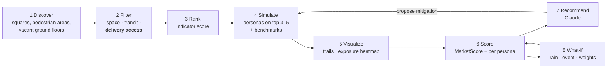
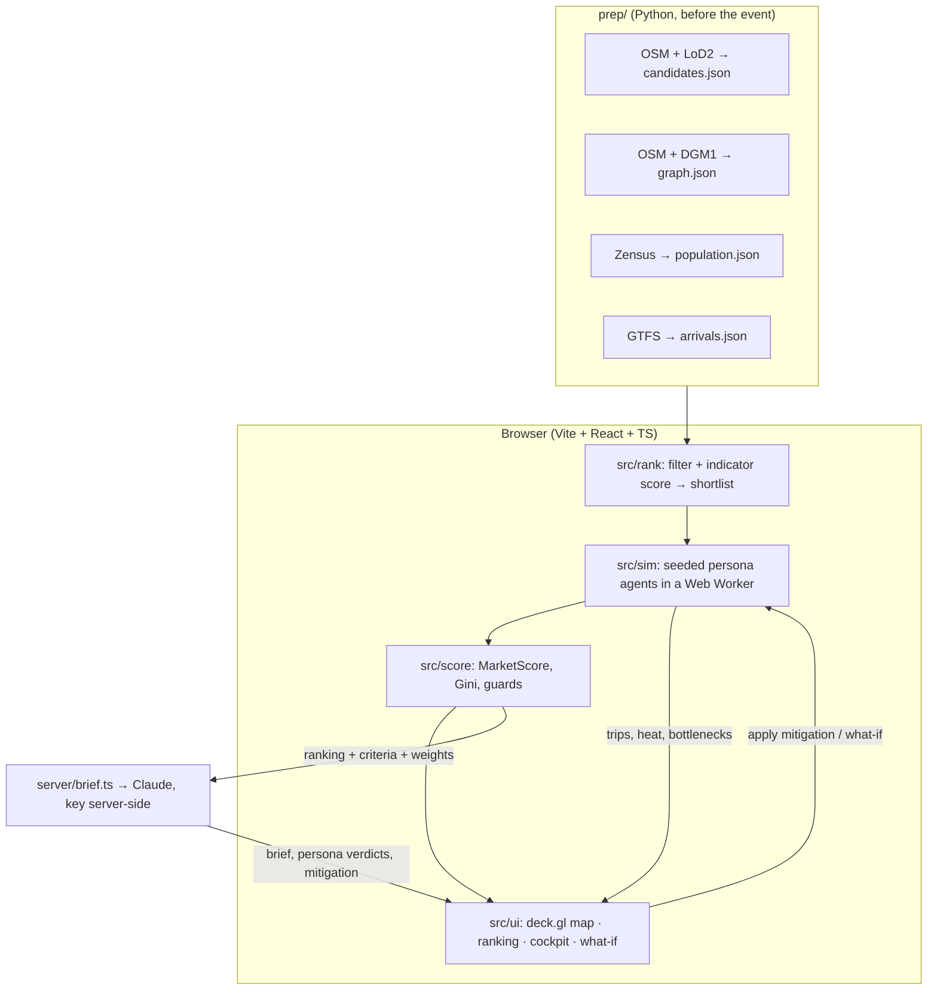

# 🏛️ UrbanTwin: Market-Sim — Master Implementation Plan

**Track 2 · Fraunhofer IIS Challenge** · Claude Impact Lab #2, Nürnberg · 7-hour build (13:00–20:00) · 4 people
**Repository:** [github.com/gi60wedo/claude_imapct_lab](https://github.com/gi60wedo/claude_imapct_lab) · **Model:** `claude-sonnet-5-5`

> **Rule zero:** the engine computes every number on screen from real Nuremberg data. No score is hard-coded. Claude explains and mitigates; it never invents a number. If a judge asks "where does 28% come from?", we can point to the route, the bollard, and the formula.

---

## 1. Problem & Solution

Nuremberg's vegetable market must leave the **Hauptmarkt** because of recurring events and logistics conflicts. The organizers name two candidates:

1. **St. Lorenzkirche plaza:** sits on the U1 station with high commuter footfall. Delivery vans meet narrow alleys and bollards at 05:30.
2. **Former Kaufhof (ground floor), Königstraße:** offers flat, sheltered, elevator-accessible space with rear loading. It lies further from the main commuter exits.

**UrbanTwin** does not stop at two sites. It scans the inner city for candidate spaces, filters out unsuitable ones, ranks the rest, and runs a persona-based pedestrian **and delivery** simulation on the shortlist. The three organizer sites always appear as benchmarks. A **MarketScore** with adjustable weights ranks the sites. The four persona scores always appear beside it, so a high total cannot hide a group that loses. Claude explains the result, proposes mitigations that the engine re-simulates, and drafts a council brief. A **what-if** panel recalculates for rain, a Christmas market, or different priorities.



### Scope tiers (enforce these)

| Priority | Scope |
|---|---|
| **Must ship** | ~15 candidates in the Altstadt and inner ring, filter with reasons, ranking, simulation on the top 3 + benchmarks, heatmap, MarketScore with weight sliders, Claude recommendation and one mitigation loop, one what-if (rainy Saturday) |
| **Should** | Christmas-market what-if, weight presets, side-by-side compare, time-slice slider |
| **Stretch** | Citywide discovery, drawing a custom site on the map |

---

## 2. The 4 Personas

| Persona | Context | Constraints the engine models | Expected preference (the simulation must confirm it) |
|---|---|---|---|
| **👵 Oma Helga** | 78, rollator, takes the U-Bahn | Steps are a hard block without an elevator; cobblestones and slope above 6% add cost; walking budget ~250 m; rain exposure | Kaufhof (flat, indoor, elevators) |
| **🚚 Markus** | 45, vendor, 3.5 t Sprinter at 05:30, 40 crates | Needs a vehicle-legal route to a loading point within 80 m; bollards and pedestrian zones block; unloading must finish by 07:00 | Kaufhof (rear loading) |
| **💼 Lukas** | 29, office worker, 30-min lunch break | Round trip from the U-Bahn exit, market visit and return must fit the time budget, or he drops out | Lorenzkirche (on the station) |
| **🛍️ Frau Weber** | 52, boutique owner nearby | Extra footfall past her frontage (+); blocked windows and produce waste (−) | Balanced |

The persona mix is not invented. The senior share comes from the Zensus 65+ grid around each site, and commuter arrivals come from the VGN timetable.

---

## 3. Data (already in `datasets/`, all open, no API key)

| Dataset | Pipeline step | Used for |
|---|---|---|
| OSM Altstadt extract (12,889 features) | 1, 2, 4 | Candidates (`place=square`, pedestrian areas), walk/drive graph, 224 bollards, 386 steps, 60 U-Bahn entrances, 34 elevators, shops, attractions |
| LoD2 CityGML, 4 × 2 km tiles (LDBV) | 1, 4, 5 | Building footprints and heights: free area per candidate, obstacles, 3D view |
| DGM1 1 m terrain, 9 tiles | 3, 4 | Slope per graph edge |
| DOP20 aerial photo + ALKIS parcels | 1, 5 | Base layer, visual check of candidate outlines |
| Zensus 2022 100 m grid (population, share 65+, average age) | 3, 4 | Population within 800 m, resident origins, senior share |
| VGN GTFS | 3, 4 | Stop frequency, U-Bahn arrival waves |

Credits for the UI and slides: *Datenquelle: Bayerische Vermessungsverwaltung – www.geodaten.bayern.de, CC BY 4.0* · *© OpenStreetMap contributors (ODbL)* · *Statistisches Bundesamt (Destatis), Zensus 2022, dl-de/by-2-0* · *VGN open data*.
Coordinates from OSM: Lorenzkirche station `49.45095, 11.07773`, Hauptmarkt Wochenmarkt `49.45393, 11.07744`. The former Kaufhof footprint (about `49.4490, 11.0800`) must be confirmed against LoD2 before 13:00.

---

## 4. Architecture



- **Only Claude runs off the browser.** Ranking and simulation are pure, seeded TypeScript, so a what-if takes about 1 s and the demo works offline.
- **Weights apply after simulation.** Moving a slider recomputes only the weighted sum, so the ranking reorders instantly.
- **Hybrid agents.** Rule-based Monte Carlo agents decide *where people walk and drive*, which keeps the result fast, reproducible and testable. Claude decides *what it means*: persona verdicts, trade-offs, mitigations. See §8 for why.

---

## 5. Data Contract (`src/contracts.ts`, freeze at 13:20)

```typescript
export type SiteKind = 'square' | 'pedestrian' | 'ground_floor' | 'benchmark';
export type Scenario = 'SUNNY_SAT' | 'RAINY_SAT' | 'CHRISTMAS_MARKET';
export type TimeSlice = '05:30_DELIVERY' | '11:30_PEAK' | '15:00_LULL';
export type PersonaId = 'senior' | 'vendor' | 'commuter' | 'retailer';

export interface Candidate {
  id: string; name: string; kind: SiteKind;
  polygon: [number, number][];            // [lng, lat]
  areaM2: number;
  indicators: { transitScore: number; walkScore: number; population800m: number;
                retailPoi400m: number; attractions400m: number;
                deliveryAccess: boolean; vanDistM: number };
  passedFilter: boolean; rejectReason?: string; quickRank?: number;
}

export interface Weights { accessibility: number; footfall: number; fairness: number;
                           localBusiness: number; walkability: number }   // sum = 1

export interface PersonaResult {
  score: number;            // 0–100, computed
  served: number; droppedOut: number;
  topFriction: string;      // e.g. "bollard at Königstraße 05:34"
  verdict?: string;         // first-person line written by Claude from these numbers
}

export interface Bottleneck {
  lat: number; lng: number; severity: number;   // 0–1, edge load / capacity
  type: 'BOLLARD_BLOCKAGE' | 'COBBLESTONE_FRICTION' | 'ELEVATOR_CONGESTION' | 'CROWDING';
  time: string; cause: string;
}

export interface SimulationResult {
  candidateId: string; scenario: Scenario; seed: number;
  mitigations: string[];
  criteria: Weights;                            // each 0–100
  personas: Record<PersonaId, PersonaResult>;
  bySlice: Record<TimeSlice, { heat: [number, number, number][]; bottlenecks: Bottleneck[] }>;
  stallExposure: number[];                      // visitors per stall slot → fairness
  trips: { persona: PersonaId; path: [number, number, number][] }[];   // [lng, lat, tSec]
}

export interface Brief {
  recommended: string; why: string[];
  comparisons: { site: string; betterAt: string; worseAt: string }[];
  losers: { persona: PersonaId; mitigation: string }[];
  councilBriefMd: string;
}
```

Commit fixtures `public/data/mock-candidates.json` and `mock-result-*.json` at 13:20. After that, nobody waits on anyone.

---

## 6. Scoring (computed, never hard-coded)

**MarketScore = 0.30·Accessibility + 0.25·Footfall + 0.20·Fairness + 0.15·LocalBusiness + 0.10·Walkability**
These are the default weights. The planner adjusts them, and they are renormalized to sum to 1.

| Criterion (0–100) | Definition |
|---|---|
| **Accessibility** | Persona-weighted share of agents who reach the market within their budget. A senior counts only if the route has no steps and stays within 200 m of a stop or elevator. A vendor counts only if a vehicle-legal route exists. |
| **Footfall** | Modeled visitor exposure per Saturday. It is a prediction, labeled "modeled exposure", and not validated against counts. |
| **Fairness** | `100 × (1 − Gini(stallExposure))`. The score drops when the corner stalls get all the visitors. |
| **Local business** | Extra footfall past shop frontages within 200 m, minus blocked frontage and waste exposure |
| **Walkability** | Mean slope, steps, cobblestone share and crossings on routes from origins |

**Persona friction (engine formulas):**

- Route cost per edge: `cost = length × M_surface × M_slope × M_rain`
  - `M_surface`: cobblestone 2.5 for seniors, 1.1 for others
  - `M_slope`: 1 + 8·max(0, slope − 0.06) for seniors
  - `M_rain`: 1.3 on unsheltered edges in `RAINY_SAT`
  - steps: ∞ for seniors without an elevator alternative
- Senior drop-off probability: `max(0, (D_effective − 200) / 100 × 0.15)`
- Vendor score: from the actual van route. A route that doesn't exist, or ends more than 80 m from the stalls, scores near zero. Otherwise the score falls with distance from the van to the stalls and with unloading time after 06:30.
- Commuter score: `max(0.10, 1 − walkMinutesFromExit / 10)`, where `walkMinutes` comes from the graph distance between the real U-Bahn entrance and the site, not straight-line distance
- **Guard:** if any persona scores below 40, the site is flagged "fails a stakeholder group", whatever its total.

Weight presets: *Accessibility first* (0.45/0.20/0.15/0.10/0.10), *Trader fairness first* (0.20/0.20/0.40/0.10/0.10), *Local business first* (0.20/0.25/0.10/0.35/0.10).

---

## 7. Team Roles

Each person owns one complete slice and its folders. Done-checks are the definition of finished.

### 🗺️ A · Geodata, Discovery & Ranking. Owns `prep/`, `public/data/`, `src/rank/`, `video/`
1. **Discover:** extract ~15–25 candidates from OSM (`place=square`, pedestrian areas above 800 m², large vacant ground floors) and add the 3 benchmarks.
2. **Indicators:** compute these per candidate:
   - free area (after subtracting LoD2 buildings)
   - GTFS stop frequency within 300 m
   - Zensus population within 800 m
   - retail and attraction POIs within 400 m
   - slope
3. **Filter:** reject a candidate, with a stated reason, if its area is below 800 m², it has no stop within 400 m, or it has no van route to a loading point within 80 m.
4. **Rank:** normalized indicator score → top 3–5 plus benchmarks.
5. **Graph:** `graph.json` with steps, bollards, slope, `vehicleAllowed`, surface and shelter per edge.
6. **Video:** from 16:30, a Playwright script records the seeded run as a 1080p MP4.

**Done when:** rejected sites show on the map greyed out with their reasons, the shortlist is defensible, and Lorenzkirche is flagged for delivery access *because the graph says so*.

### ⚙️ B · Pedestrian & Delivery Twin. Owns `src/sim/` (pure TS, Vitest)
1. Seeded RNG (mulberry32). Agent origins: U-Bahn and tram arrivals (GTFS), Zensus residential cells, shopping streets, attractions.
2. Persona mix from the data: senior share from Zensus 65+, commuter waves from GTFS, vans from 05:30 to 07:00.
3. Dijkstra on `graph.json` with the per-persona cost functions from §6.
4. 30-second ticks from 05:30 to 15:00: arrive → route → stall visits → leave, with drop-outs. Output per time slice: `05:30_DELIVERY`, `11:30_PEAK`, `15:00_LULL`.
5. Outputs: the five criteria, persona results, stall exposure, bottlenecks, trips and heat.
6. Scenario switches and mitigation hooks:
   - rain
   - a Christmas market that blocks the Hauptmarkt and doubles tourists
   - added kiosk nodes, delivery windows and stall layouts

**Done when:** one site × scenario runs in under 1.5 s in the worker, the same seed gives the same result, and the shortlist sites show clearly different persona profiles.

### 🖥️ C · Map, Ranking & Cockpit UI. Owns `src/ui/`
1. **Map:** deck.gl over MapLibre with the DOP20 base, extruded LoD2 buildings, and candidate polygons colored by rank (rejected ones greyed out with a reason tooltip).
2. **Simulation layers:**
   - `TripsLayer` agents: 🟣 seniors (slow, pausing on cobblestones), 🟠 vans (stopping at bollards), 🔵 commuters
   - exposure `HeatmapLayer`
   - bollard and bottleneck markers
   - kiosk markers when a mitigation is applied
3. **Controls:** time-slice slider (05:30 / 11:30 / 15:00) and play/pause.
4. **Ranking panel:** MarketScore bars that reorder live as the **five weight sliders** move, plus presets.
5. **What-if bar:** Sunny / Rainy / Christmas market.
6. **Cockpit:** Consensus dial, four persona cards (score, friction chip, Claude verdict), brief panel, **Apply Claude mitigation**, **Export council brief**.

**Done when:** moving a weight reorders the ranking in under 100 ms and the map stays at 60 fps with 100 trails.

### 🧠 D · Scoring, Claude & Pitch. Owns `src/score/`, `server/brief.ts`, pitch deck
1. **`score.ts`:** normalization, MarketScore, the fairness Gini and the persona-below-40 guard.
2. **`/api/brief`:** sends the ranking, criteria and active weights to `claude-sonnet-5-5` with a forced `write_recommendation` tool (the Brief schema). Claude must cite engine numbers and compare against at least two alternatives.
3. **Persona verdicts:** one call per persona, not per agent, turns that persona's metrics into a first-person line for the "Citizen Voice" feed.
4. **Propose → simulate → judge loop:** a `propose_mitigation` tool returns a structured intervention, B's engine reruns it, and the personas judge again.
5. **What-if:** each re-brief comes with a short "what changed and why" delta.
6. **Fallback:** cached briefs per scenario for offline use. The key lives in `.env` and is never committed.
7. **Integration and pitch:** D owns integration from 17:00, plus the 2-minute pitch and the Method slide.

**Done when:** every number in the brief matches the input, the brief arrives in under 6 s, and the cached fallback works with the network unplugged.

---

## 8. Prior Work: What We Take From It

| Work | What it shows | What we adopt |
|---|---|---|
| Park et al., *Generative Agents: Interactive Simulacra of Human Behavior*, Stanford/Google, [arXiv:2304.03442](https://arxiv.org/abs/2304.03442) | LLM agents with profiles, memory and plans behave believably in a sandbox town | Persona profiles, goals and schedules. We skip memory streams because they are too slow and costly for 100 agents live. |
| Verma et al., *Generative agents in the streets: Exploring the use of LLMs in collecting urban perceptions*, [arXiv:2312.13126](https://arxiv.org/abs/2312.13126) | Persona agents judge street environments from imagery and OSM. The paper studies **perception**, not route choice. | Persona-specific verdicts on a site, written by Claude from the computed metrics |
| Zheng et al., *Urban planning in the era of large language models*, MIT Senseable City Lab, Nature Computational Science (2025) | A conceptualize → generate → evaluate loop in which synthetic residents use competing designs, scored on equity, travel distance and facility use | Evaluating competing sites with synthetic residents; equity and distance as criteria |
| Zhou et al., *LiPUP-MA: living-in-the-loop participatory urban planning*, [arXiv:2412.20505](https://arxiv.org/abs/2412.20505) | Planner agents propose, residents "live" in the plan and complain, and the plan is revised in cycles | The **propose → simulate → judge** mitigation loop |
| Piao et al., *AgentSociety*, [arXiv:2502.08691](https://arxiv.org/abs/2502.08691) · Yan et al., *OpenCity*, [arXiv:2410.21286](https://arxiv.org/abs/2410.21286) | Thousands of LLM agents in GIS environments; scaling needs grouping into archetypes | One LLM call per persona, not per agent |
| *When Plausible Is Not Realistic: Evaluating Human Mobility in LLM-Based Urban Simulation*, [arXiv:2606.13835](https://arxiv.org/abs/2606.13835) | LLM-generated mobility can look plausible and still fail to match real movement statistics | The reason our **movement is rule-based and seeded** |

Further reading: [Awesome-Urban-LLM-Agents](https://github.com/usail-hkust/Awesome-Urban-LLM-Agents). On slides, cite the papers above by title. Do not claim the project is "built by MIT/Stanford" or cite a paper we have not checked.

---

## 9. Before the Event

| Task | Owner |
|---|---|
| Run `prep/` and commit the small `public/data/*.json` outputs | A |
| Confirm the former Kaufhof footprint and loading point from LoD2 and the aerial photo | A |
| Repo scaffold (Vite, React, Tailwind, deck.gl, Vitest) with an empty `contracts.ts` | C |
| Check that the Anthropic key works with a one-call tool-use script | D |

---

## 10. Hour-by-Hour Sprint with Gates

| Time | A · Discovery & Ranking | B · Twin | C · UI | D · Score, Claude, Pitch |
|---|---|---|---|---|
| **13:00–13:30** Kickoff | Check that the prep outputs load | Freeze `contracts.ts` + fixtures (with D) | Freeze `contracts.ts` + fixtures (with D) | Agree default weights and filter thresholds |
| **13:30–15:00** Core | Candidate extraction, indicators, filter with reasons | RNG, origins, personas, Dijkstra costs, tests | Map, 3D, candidate layer, ranking on fixtures | `score.ts`; `/api/brief` on fixtures |
| ⛳ **Gate 15:00** | Real candidate list with reasons | Engine runs one site | UI shows fixtures end to end | Claude returns a valid Brief |
| **15:00–16:30** Dynamics | Shortlist, then help B with stall slots and capacities | Stall visits, drop-outs, criteria, time slices, scenarios, mitigation hooks | Trails, heatmap, sliders, what-if bar, time slider | Persona verdicts, mitigation loop, cache, pitch draft |
| **16:30–17:00** Dinner | Full pipeline on real data; list integration bugs | | | |
| **17:00–18:00** Integrate | Video recorder, take 1 | Calibrate; check the numbers make sense | Wire worker, ranking, brief; polish | End-to-end runs, bug fixes |
| ⛳ **Gate 18:00** | **Code freeze.** The full demo path works 3 times in a row. | | | |
| **18:00–18:30** | Final video with captions and credits | Method slide: formulas, assumptions | Projector contrast | 4 timed pitch runs |
| **18:30–20:00** | Holds the video fallback | Answers method questions | Drives the demo | Presents |

---

## 11. The 2-Minute Pitch

The bracketed numbers are placeholders. Read the real values from the final calibrated run and never quote a number the engine didn't produce.

- **[0:00–0:20] Hook** *(video: camera flies into the 3D Altstadt)*
  *"Nuremberg's vegetable market has to leave the Hauptmarkt. Put it at Lorenzkirche, and delivery vans can't get in at half past five. Put it in the old Kaufhof, and lunch commuters say it's too far. Cities spend years and expensive surveys on choices like this, and someone always loses."*

- **[0:20–0:45] Solution**
  *"UrbanTwin is a digital twin of Nuremberg built from official Bavarian survey data, the census and the VGN timetable. We don't start from two sites. We scan the city…"* *(about 20 candidates appear, and the filter greys most of them out: "no van access", "too small")* *"…and simulate a market Saturday on the best ones, from 78-year-old Oma Helga with her rollator to Markus in his 3.5-ton Sprinter."*

- **[0:45–1:30] Live demo**
  *(Lorenzkirche)* *"Commuters love it: [94]%. But watch Markus. His van route ends at this bollard, so the vendor score falls to [28]%."*
  *(Kaufhof)* *"Kaufhof: vendors [92]%, Oma Helga [95]%. But Lukas loses [36]% of his lunch time."*
  *(Apply Claude mitigation)* *"Claude proposes three express kiosks at the U-Bahn exit. The engine re-simulates, and consensus rises to [88]%. Claude proposes and the simulation verifies."*
  *(Rainy + "Trader fairness first")* *"Change the weather or the city's priorities, and the ranking updates live."*

- **[1:30–2:00] Close**
  *"This isn't a chatbot that guesses. Every number comes from the real streets, people and timetables of Nuremberg, and Claude turns them into a decision a city council can defend. Built with Claude, ready for Nuremberg."*

---

## 12. Risks & Fallbacks

| Risk | Fallback |
|---|---|
| "Your numbers are rigged" | Fixed seed shown on screen, Method slide with formulas, live rerun with a different seed |
| "The weights decide the winner" | Say it openly: the weights are the planner's value judgment. Show the winner holds under 2 of 3 presets. |
| Discovery returns odd candidates (car parks, private courtyards) | Tag exclusions plus a manual allow/deny list in `sites.json` |
| "Isn't this just generative agents?" | §8: movement is rule-based because LLM mobility is unrealistic; Claude adds the reasoning |
| Venue Wi-Fi or API outage | Cached briefs, all data local, recorded video |
| Engine late at 15:00 | Ranking and Claude run on the indicator score alone; A joins B |
| Merge conflicts | Strict folder ownership, short branches; D merges to `main` |

---

## 13. Repository Layout

```
claude_imapct_lab/
├─ datasets/        raw downloads, fetch.sh, zensus/fetch_zensus.py, README.md
├─ prep/            A: Python converters → public/data
├─ public/data/     candidates · graph · population · arrivals · mock fixtures
├─ src/contracts.ts shared types (frozen 13:20)
├─ src/rank/        A: filter + ranking
├─ src/sim/         B: pedestrian & delivery twin, worker, tests
├─ src/score/       D: MarketScore, Gini, guards
├─ src/ui/          C: map, ranking, what-if, cockpit
├─ server/brief.ts  D: Claude route, prompts, cached briefs
├─ video/record.ts  A: Playwright capture → urbantwin.mp4
└─ docs/            UrbanTwin_Group_Plan.pdf (printable version of this plan)
```
