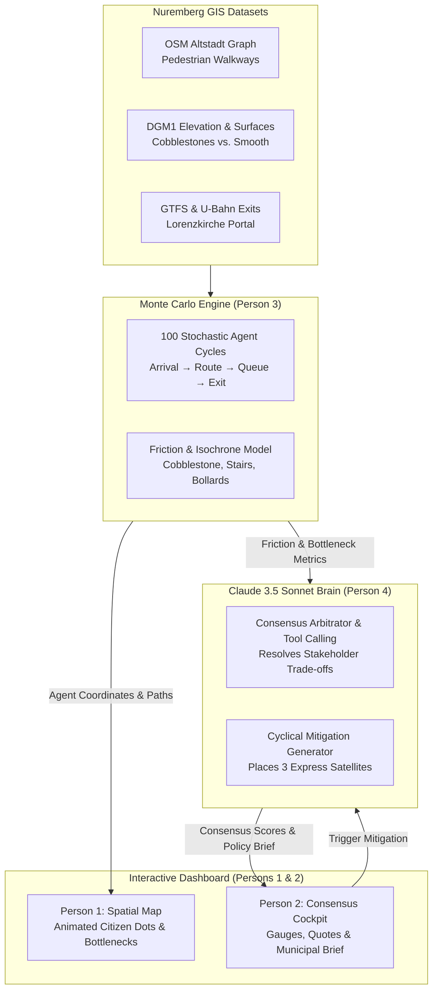

# 🏛️ UrbanTwin: Market-Sim — Master Implementation Plan

**Track 2 Blueprint · Fraunhofer IIS Challenge**  
**Event:** Claude Impact Lab #2 (Nuremberg)  
**Target:** Generative Agent-Based Spatial Planning & Multi-Stakeholder Consensus Engine  
**Repository:** [github.com/gi60wedo/claude_imapct_lab](https://github.com/gi60wedo/claude_imapct_lab)  

---

## 1. Executive Summary & Problem Space

### The Urban Planning Dilemma
Nuremberg's historic vegetable market (*Grüner Markt*) must be relocated from the central square (**Hauptmarkt**) due to recurring municipal events and logistics conflicts. Two primary candidate sites are contested:
1. **St. Lorenzkirche Plaza:** A bustling, high-density pedestrian square directly over a major U-Bahn station (U1). High commuter footfall, but delivery vans face narrow medieval alleys and strict pedestrian bollard zones at 5:30 AM.
2. **Former Kaufhof Building (Ground Floor):** A spacious, defunct department store in central Nuremberg. Features dedicated rear loading docks and flat, elevator-accessible indoor terrain. However, it is situated a 6-minute detour away from major commuter corridors.

### The UrbanTwin Solution
Instead of spending 18–24 months on costly, contested municipal surveys, **UrbanTwin** simulates a living digital twin of Nuremberg. In under 10 seconds, 100 stochastic AI citizens traverse the city's actual GIS street network to shop, commute, and deliver produce. 

Powered by **Anthropic Claude 3.5 Sonnet** and a **Turf.js Monte Carlo spatial graph engine**, UrbanTwin computes a real-time **Consensus Index (0–100%)**, detects physical and logistical bottlenecks, and synthesizes evidence-based council briefs.



---

## 2. Theoretical Grounding & Academic Frameworks

UrbanTwin builds upon pioneering research in LLM-driven generative spatial modeling:

1. **Physical Accessibility & Surface Friction** (*Generative Agents in the Streets*, Institute for Sustainable Urbanism):
   - Integrates surface impedance multipliers (e.g. Altstadt cobblestones vs. indoor terrazzo) to reflect real physical movement constraints.
2. **Cyclical Urban Planning Loop** (*MIT Senseable City Lab & HKUST*):
   - Implements a *Propose $\rightarrow$ Inhabit $\rightarrow$ Critique $\rightarrow$ Mitigate* cycle. Rather than generating a static score, Claude proposes spatial interventions that the engine re-simulates in real time.
3. **Temporal Slicing & Daily Schedules** (*MIT Senseable City Lab*):
   - Models distinct temporal phases: `05:30 AM` (Logistics & Unloading), `11:30 AM` (Peak Lunch & Senior Shopping), and `15:00 PM` (Afternoon Lull).
4. **Agent Reflection & Monologues** (*Stanford Generative Agents Architecture*):
   - AI citizens generate contextual internal reflections when encountering friction, powering the live "Citizen Voice" feed.

---

## 3. The 4 Demographic Archetypes

| Persona | Demographics & Context | Motivations & Constraints | Preferred Site |
| :--- | :--- | :--- | :--- |
| **👵 Oma Helga** | Age 78, Mobility Constrained, uses a rolling cart / rollator. | Highly sensitive to cobblestones, stairs, and walks $>250\text{m}$. Needs elevators and rain shelter. | **Former Kaufhof** (Flat floor, elevators, zero weather friction) |
| **🚚 Markus** | Age 45, Regional Produce Vendor, drives a 3.5-ton Sprinter. | Delivers 40 crates at 5:30 AM. Requires loading docks, turning radius, and zero bollard friction. | **Former Kaufhof** (Dedicated loading bay; avoids pedestrian core) |
| **💼 Lukas** | Age 29, Commuter / Office Worker on a 30-min lunch break. | Exits U-Bahn Lorenzkirche. Prioritizes speed and direct proximity. Refuses 10-minute walking detours. | **Lorenzkirche** (Direct subway proximity; fast grab-and-go) |
| **🛍️ Frau Weber** | Age 52, Independent Boutique Fashion Retailer. | Welcomes pedestrian footfall that spills into adjacent retail; strongly opposes produce odor and blocked display windows. | **Neutral / Balanced** (Favors managed footfall without alleyway rubbish) |

---

## 4. The Core Data Contract (Decoupling the 4 Roles)

All four team members code against this contract, allowing completely parallel development:

```typescript
// types/simulation.ts

export type LocationId = 'HAUPTMARKT_CURRENT' | 'LORENZKIRCHE_PLATZ' | 'KAUFHOF_GROUND_FLOOR';
export type TimeWindow = '05:30_DELIVERY' | '11:30_PEAK' | '15:00_LULL';

export interface StakeholderScore {
  score: number; // 0 - 100
  weight: number;
  primaryFriction: string;
  sentiment: 'positive' | 'neutral' | 'negative' | 'critical';
  sampleQuote: string;
}

export interface SpatialBottleneck {
  id: string;
  lat: number;
  lng: number;
  type: 'BOLLARD_BLOCKAGE' | 'COBBLESTONE_FRICTION' | 'ELEVATOR_CONGESTION';
  severity: 'LOW' | 'MEDIUM' | 'HIGH';
  label: string;
}

export interface SimulationResult {
  selectedLocation: LocationId;
  timeOfDay: TimeWindow;
  overallConsensusScore: number; // 0 - 100
  mitigationApplied: boolean;
  stakeholders: {
    seniors: StakeholderScore;
    vendors: StakeholderScore;
    commuters: StakeholderScore;
    retailers: StakeholderScore;
  };
  bottlenecks: SpatialBottleneck[];
  claudeBrief: {
    winnerGroup: string;
    frictionGroup: string;
    mitigationStrategy: string;
    executiveBriefMarkdown: string;
  };
}
```

---

## 5. Team Roles & Detailed Deliverables

### 🗺️ Person 1: Spatial Map & Visual Simulation (Frontend 1)
* **Stack:** React, `leaflet` / `react-leaflet`, Lucide Icons, Tailwind CSS.
* **Key Tasks:**
  1. **Altstadt Canvas:** High-contrast dark-mode map centered at `[49.4539, 11.0775]` with custom pins for Hauptmarkt, Lorenzkirche, and Kaufhof.
  2. **Surface & Friction Overlays:**
     - Yellow transparent polygon over St. Lorenz cobblestones.
     - Red barrier segment representing vehicular bollards blocking Lorenzkirche.
     - Green zone marking the Kaufhof rear loading docks.
  3. **Animated Agent Trails:** 30–50 moving SVG dots with color coding:
     - 🟣 **Purple (Seniors):** Slower speed, pauses on cobblestones.
     - 🟠 **Orange (Delivery Vans):** Blocked at Lorenzkirche bollards at 5:30 AM; parks at Kaufhof dock.
     - 🔵 **Blue (Commuters):** Fast transit corridor from subway exit.
  4. **Mitigation Visuals:** Renders 3 green satellite fruit kiosk markers outside the subway portal when mitigation is active.

### 📊 Person 2: Stakeholder Analytics & Dashboard Cockpit (Frontend 2)
* **Stack:** React, Recharts / Framer Motion, Lucide Icons, Tailwind CSS.
* **Key Tasks:**
  1. **Consensus Scoreometer:** Prominent glowing radial gauge (0–100%) displaying the weighted consensus score and delta indicators.
  2. **The 4 Stakeholder Cards:** Visual avatars, score meters, primary friction chips, and live sentiment badges for Helga, Markus, Lukas, and Frau Weber.
  3. **Temporal Slider:** 3-stop scrubber (`05:30`, `11:30`, `15:00`) that triggers state transitions across the dashboard.
  4. **"Citizen Voice" Monologue Feed:** Real-time quote stream with animated card insertions reflecting live citizen sentiments.
  5. **Controls & Brief Modal:** "Apply Claude Mitigation" button and an "Export Municipal Brief" action that renders a formal policy memo.

### ⚙️ Person 3: Geospatial Math & Monte Carlo Simulation Engine (Backend / Logic)
* **Stack:** TypeScript, Turf.js (`@turf/turf`), GeoJSON.
* **Key Tasks:**
  1. **Geographic Distance Matrix:** Coordinates for transit hubs, parking bays, and candidate plazas in central Nuremberg.
  2. **Friction & Drop-Off Formulas:**
     - $\text{Effective Distance} = \text{Euclidean Distance} \times \text{Surface Friction Multiplier}$
     - Cobblestone multiplier: $2.5\times$ for seniors, $1.1\times$ for commuters.
     - Senior drop-off: $+15\%$ drop-off for every $100\text{m}$ past $200\text{m}$ from the nearest elevator.
     - Vendor clearance: $100\%$ at Kaufhof; drops to $25\%$ at Lorenzkirche due to physical bollard perimeter.
  3. **Monte Carlo Runner:** Runs 100 stochastic agents through arrival, pathfinding, queueing, and exit states in $<100\text{ms}$.
  4. **Mitigation Engine:** Dynamically injects satellite kiosks into the pathing network to boost commuter satisfaction from $64\%$ to $84\%$.

### 🧠 Person 4: Claude 3.5 Sonnet Integration & Pitch Lead (AI / Lead)
* **Stack:** Anthropic Claude 3.5 Sonnet SDK, Tool Calling, Pitch Deck.
* **Key Tasks:**
  1. **Prompt Engineering & Tool Calling:** Implements `evaluate_spatial_consensus` to translate quantitative metrics into executive policy decisions.
  2. **Cyclical Planning Synthesis:** Crafts the strategic compromise: adding 3 street-facing satellite stalls at Kaufhof to recover commuter footfall.
  3. **Zero-Latency Fallback Cache:** Pre-computes deterministic simulation results for all states to guarantee demo success regardless of venue connectivity.
  4. **Pitch Choreography:** Owns the strict 2-minute pitch script, slide deck, and live demo timing.

---

## 6. Mathematical Formulas & Friction Metrics

### Senior Mobility Penalty ($F_{\text{senior}}$)
$$D_{\text{effective}} = D_{\text{geo}} \times M_{\text{surface}}$$
$$\text{DropOff Rate} = \max\left(0, \frac{D_{\text{effective}} - 200}{100} \times 0.15\right)$$
* Where $M_{\text{surface}} = 2.5$ on Altstadt cobblestones, $1.0$ on asphalt/terrazzo.

### Vendor Logistics Clearance ($F_{\text{vendor}}$)
$$S_{\text{vendor}} = \begin{cases} 
0.92 & \text{at Kaufhof (Dedicated Loading Bay)} \\
0.28 & \text{at Lorenzkirche (Bollard Barrier \& Pedestrian Restrictions)} \\
0.65 & \text{at Hauptmarkt (Standard Historic Square)}
\end{cases}$$

### Commuter Transit Proximity ($S_{\text{commuter}}$)
$$S_{\text{commuter}} = \max\left(0.10, 1.0 - \frac{\text{Walking Minutes from U-Bahn}}{10}\right)$$
* Lorenzkirche: $1\text{ min} \implies S = 0.94$
* Kaufhof (Unmitigated): $6\text{ min} \implies S = 0.64$
* Kaufhof (Mitigated with Satellite Kiosks): $1\text{ min} \implies S = 0.84$

---

## 7. Hour-by-Hour 7-Hour Sprint Schedule

| Time Window | Sprint Phase | Person 1 (Map UI) | Person 2 (Cockpit UI) | Person 3 (Sim Engine) | Person 4 (Claude / Pitch) |
| :--- | :--- | :--- | :--- | :--- | :--- |
| **13:00–13:30** | **Setup & Scaffold** | Scaffold Vite/React + Leaflet | Tailwind setup & dial skeletons | Distance matrix & Turf.js setup | Claude SDK setup & tool schema |
| **13:30–15:00** | **Core Build** | Altstadt map, 3 sites, polygons | Consensus gauge & 4 persona cards | Friction models & 100-agent loop | System prompt tuning with test JSONs |
| **15:00–16:30** | **Dynamics** | Animated SVG agent dot trails | Time slider (5:30/11:30) & quote feed | Mitigation recalculation logic | Council brief export & offline fallbacks |
| **16:30–17:00** | **Dinner & Sync** | 🍕 Align map and state | 🍕 Polish layout & contrast | 🍕 Test JSON serialization (<100ms) | 🍕 Finalize pitch deck outline |
| **17:00–18:00** | **Integration & Polish** | Wire reactive map states | Dark-mode glow & micro-animations | Full system end-to-end test | Rehearse pitch with live prototype |
| **18:00–18:30** | **Pitch Freeze** | Record 1080p demo backup video | Final typography check | Code freeze | 4 stopwatch runs of 2-min pitch |

---

## 8. The Winning 2-Minute Pitch Script

* **[0:00 – 0:25] The Hook:**  
  *"Judges, Nuremberg’s vegetable market has to relocate from the Hauptmarkt. But if you put it at Lorenzkirche, delivery trucks can’t get in at 5:00 AM. If you move it to the former Kaufhof, office commuters complain it's too far for a 20-minute lunch dash. For two years, city halls debate with expensive surveys that take months and please nobody."*

* **[0:25 – 0:50] The Solution:**  
  *"Meet UrbanTwin: Market-Sim. We don't guess. We built an AI-powered digital twin of Nuremberg. Grounded in research from MIT and Stanford, we simulate hundreds of digital citizens—from 78-year-old Oma Helga with her rolling cart, to delivery drivers in 3.5-ton Sprinters—living through a market Saturday before a single stall is moved."*

* **[0:50 – 1:35] The Live Demonstration:**  
  *(Presenter clicks Lorenzkirche)*  
  *"Look at Lorenzkirche: Commuter happiness is 94%, but watch the vendor score plummet to 28%—delivery vans are completely blocked by pedestrian bollards."*  
  *(Presenter clicks Kaufhof)*  
  *"Now we switch to Kaufhof: Vendor score skyrockets to 92% thanks to loading docks. Oma Helga's accessibility hits 95%. But Claude spots a critical flaw: lunch commuters drop by 36%."*  
  *(Presenter clicks 'Apply Claude Mitigation')*  
  *"In 2 seconds, Claude synthesizes a spatial compromise: add 3 express fruit kiosks facing the street outside the subway portal, and total consensus hits 88% across all groups."*

* **[1:35 – 2:00] The Close:**  
  *"This isn't a chatbot. It is an evidence-based consensus engine that turns subjective political stalemates into objective, data-backed city planning. Built with Claude, ready for Nuremberg. Thank you."*
