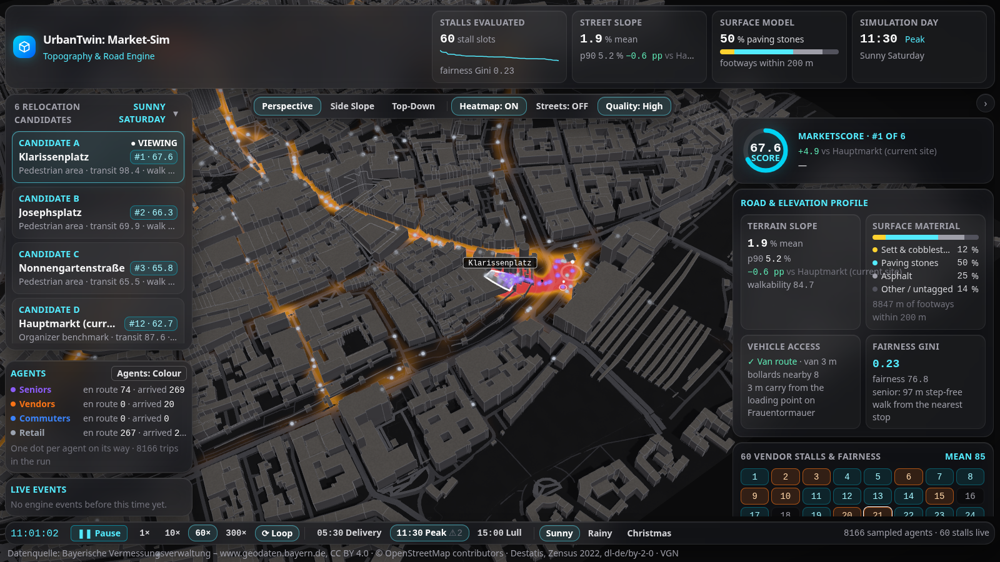
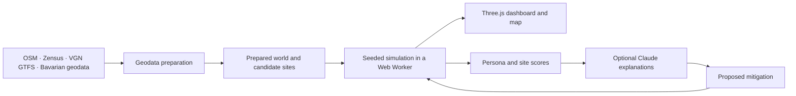

# UrbanTwin Market-Sim

A digital twin of Nuremberg’s Altstadt for comparing market locations through pedestrian and delivery simulations.

[Project overview](docs/PROJECT_OVERVIEW.html) · [Implementation plan](IMPLEMENTATION_PLAN.md) · [Data sources](datasets/README.md) · [Simulation model](src/sim/README.md)



## What it does

Moving a vegetable market changes access for seniors, delivery routes for vendors, commuter travel times, and footfall for nearby shops. UrbanTwin compares Hauptmarkt, Lorenzkirche, the former Kaufhof, and discovered candidate sites using geographic data and a seeded simulation.

The Three.js dashboard renders real building roofs and terrain in a dark monochrome city. Moving dots show simulated agents. Candidate cards, persona scores, heat overlays, and a live clock let you inspect the trade-offs. The optional Claude service explains engine results and proposes mitigations that the engine can simulate again.

## Run the dark 3D view

Requires **Node.js 22.18 or newer**, npm, and a browser with WebGL support. Prepared browser data is included in the repository.

```bash
git clone https://github.com/gi60wedo/claude_imapct_lab.git
cd claude_imapct_lab
npm ci
npm run dev -- --port 5173
```

Open **[http://localhost:5173/?view=three](http://localhost:5173/?view=three)**.

The `view=three` parameter selects the dark dashboard. The root URL opens the map and ranking interface. The browser runs the simulation in a Web Worker; the 3D view needs no API key.

## Explore a scenario

1. Select a candidate to compare its scores and inspect the site in 3D.
2. Switch between sunny Saturday, rainy Saturday, and Christmas market scenarios.
3. Use the live clock to play, pause, change speed, or jump to a time slice.
4. Choose perspective, top, or side camera views. Toggle heat and street overlays.
5. Switch agent dots between persona colours and white for a monochrome scene.
6. Apply a kiosk, delivery window, loading point, or stall layout mitigation and compare the simulated result.

For a repeatable UI demonstration with fixture results, open `http://localhost:5173/?view=three&data=fixtures`. Fixtures are demonstration data. The normal 3D URL uses the simulation engine.

## Optional Claude explanations

The default UI uses fixture briefs. To request server-generated explanations, start the API in a second terminal:

```bash
BRIEF_OFFLINE=1 npm run server
```

Open `http://localhost:5173/?view=three&brief=live`. Offline mode serves cached or template explanations. For Claude responses, configure `ANTHROPIC_API_KEY` in a local `.env` file and run `npm run server` without `BRIEF_OFFLINE`. The server listens on port 8787, and Vite proxies `/api` requests to it.

Explanations use simulation results. The engine computes the scores and reruns proposed mitigations.

## Verify the project

```bash
npm run build                 # TypeScript check and production bundle
npm test -- --run --maxWorkers=1  # Unit and integration tests, without watch mode
npm run sim:report            # Compare three benchmark sites across three scenarios
npx playwright install chromium
npm run e2e -- e2e/three.spec.ts
```

The Three.js browser tests exercise camera modes, candidate switching, moving agents, monochrome styling, and scenario changes. They write screenshots to `e2e/__shots__/`. WebGL tests require a Chromium environment with GPU support.

## How it works



Routing accounts for street surfaces, steps, slope, weather, vehicle access, and barriers. Agent decisions use walking and time budgets. A fixed seed makes comparisons reproducible. Model assumptions live in [`src/sim/params.ts`](src/sim/params.ts).

The live dashboard requests full-scale runs with all returned trips. A dot represents an agent active at the current simulation time; the visible count changes through the day.

## Data and preparation

The browser reads prepared assets from `public/data/`. Raw sources and their attribution are documented in [`datasets/README.md`](datasets/README.md). Rebuilding geographic assets requires Python tooling through `uv`; large LoD2 inputs use Git LFS. Follow [`prep/README.md`](prep/README.md) for preparation and ranking commands. The 3D roof format is documented in [`public/data/roofs3d.README.md`](public/data/roofs3d.README.md).

## Limits

- Agent behaviour, budgets, and scores are model assumptions. Scores describe this simulation and require validation before planning decisions.
- Agent sampling affects some scores: Kaufhof fairness in the rainy seed-42 run changes from 70.5 at quarter scale to 76.8 at full scale. The live dashboard uses full scale.
- Missing or disconnected OSM barriers and unmapped elevators can affect access estimates.
- Building footprints do not establish usable indoor market area.
- Weather visuals illustrate scenarios; they do not represent a weather forecast.

## Project and credits

Built for **Claude Impact Lab #2, Nuremberg**, Track 2: Fraunhofer IIS Challenge. Team responsibilities and the execution plan appear in [`IMPLEMENTATION_PLAN.md`](IMPLEMENTATION_PLAN.md).

- Bayerische Vermessungsverwaltung: building, terrain, aerial, and parcel data, CC BY 4.0.
- OpenStreetMap contributors: street and point-of-interest data, ODbL.
- Destatis: Zensus 2022 data, dl-de/by-2-0.
- VGN: public transport timetable data; see the dataset documentation for source terms.

The repository has no software license file. Dataset licenses apply to their respective data. Report bugs or suggest improvements through [GitHub issues](https://github.com/gi60wedo/claude_imapct_lab/issues).
